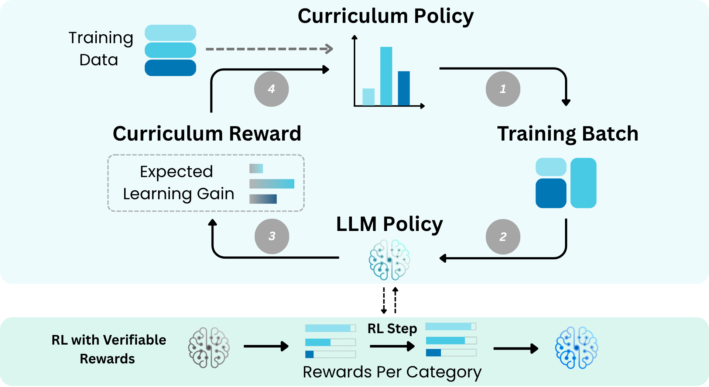

<div align="center">

# Self-Evolving Curriculum for LLM Reasoning
[](https://arxiv.org/abs/2505.14970)
</div>


<p align="center">

</p>

[**Self-Evolving Curriculum (SEC)**](https://arxiv.org/abs/2505.14970) is an automatic curriculum learning method that learns a curriculum policy concurrently with the RL fine-tuning process for LLMs.  At each RL training step, SEC frames curriculum category selection (e.g., difficulty level, domain) as a non-stationary multi-armed bandit, uses an advantage-based reward proxy to estimate immediate learning gain, and updates the curriculum policy on-the-fly.


## Installation
```bash
conda create -n sec python=3.10 -y
conda activate sec
pip install -e ./verl
```

## Usage

### Reproduce the Countdown experiment in the paper with Qwen2.5-3B
```bash
sh examples/countdown.sh difficulty_bandit_0.5_t1.0_Qwen2.5_3B \
    trainer.sec.enable=True \
    trainer.sec.strategy=bandit \
    trainer.sec.bandit.lr=0.5 \
    trainer.sec.bandit.objective=adv \
    trainer.total_training_steps=240 \
    actor_rollout_ref.model.path=Qwen/Qwen2.5-3B
```

### Reproduce the Math experiment in the paper with Qwen2.5-7B
```bash
sh examples/math.sh difficulty_bandit_0.5_t0.4_Qwen2.5_7B \
    trainer.sec.enable=True \
    trainer.sec.strategy=bandit \
    trainer.sec.bandit.lr=0.5 \
    trainer.sec.bandit.objective=adv \
    trainer.total_training_steps=240 \
    actor_rollout_ref.model.path=Qwen/Qwen2.5-7B \
    actor_rollout_ref.rollout.gpu_memory_utilization=0.6 \
    trainer.sec.bandit.temperature=0.4;
```

### Reproduce the SEC-2D experiment in the paper with Qwen2.5-3B
```bash
sh examples/puzzle_2d.sh 2d_puzzle_difficulty_bandit_0.5_t0.2_Qwen2.5_3B \
    trainer.sec.enable=True \
    trainer.sec.strategy=bandit \
    trainer.sec.bandit.lr=0.5 \
    trainer.total_training_steps=720 \
    trainer.sec.bandit.temperature=0.2;
```

## Acknowledgements

- Our codebase is built on and integrated with the [verl](https://github.com/volcengine/verl) library.
- We utilize [DeepScaleR](https://github.com/agentica-project/rllm) for data preprocessing and reward functions in mathematics datasets.

## Citation

If you find this codebase inspiring in your research, please cite:

```bibtex
@article{chen2025self,
  title={Self-Evolving Curriculum for LLM Reasoning},
  author={Chen, Xiaoyin and Lu, Jiarui and Kim, Minsu and Zhang, Dinghuai and Tang, Jian and Pich{\'e}, Alexandre and Gontier, Nicolas and Bengio, Yoshua and Kamalloo, Ehsan},
  journal={arXiv preprint arXiv:2505.14970},
  year={2025}
}
```


## Contact

Feel free to reach out with questions, bug reports, or collaboration ideas.

*Xiaoyin Chen* – [xiaoyin.chen@mila.quebec](mailto:xiaoyin.chen@mila.quebec)
